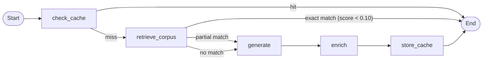

# Consolidate Scraping Folder and Build RAG Ingestion Pipeline

## Part 1: Move all scraping/corpus files into one folder and gitignore it

Currently scraping-related files are scattered:

- `scripts/scrape-balkan-recipes.ts`
- `scripts/scrape-balkan-all.ts`
- `data/balkan-recipes/corpus.json`
- `data/balkan-recipes/list-urls.txt`
- `data/balkan-recipes/README.md`
- `docs/RAG_BALKAN_RECIPE_CORPUS_PLAN.md`

**Move everything into `scraping/`:**

```
scraping/
  scrape-balkan-recipes.ts    (from scripts/)
  scrape-balkan-all.ts        (from scripts/)
  list-urls.txt               (from data/balkan-recipes/)
  corpus.json                 (from data/balkan-recipes/)
  ingest-balkan-corpus.ts     (NEW - created in Part 2)
  README.md                   (from data/balkan-recipes/)
  RAG_BALKAN_RECIPE_CORPUS_PLAN.md  (from docs/)
```

**Gitignore:** Replace the current scattered entries with a single `scraping/` entry.

**Update `package.json` scripts** to point at new paths:

- `scrape:balkan` -> `tsx scraping/scrape-balkan-recipes.ts`
- `scrape:balkan:all` -> `tsx scraping/scrape-balkan-all.ts`
- Add `ingest:corpus` -> `tsx scraping/ingest-balkan-corpus.ts`

**Update internal paths** in `scrape-balkan-all.ts` (list-urls path, output path).

---

## Part 2: Build the corpus vector store

Create `[app/lib/stores/balkanCorpusStore.ts](app/lib/stores/balkanCorpusStore.ts)` following the same pattern as the existing stores (`[recipeVectorStore.ts](app/lib/stores/recipeVectorStore.ts)`, `[similarRecipesStore.ts](app/lib/stores/similarRecipesStore.ts)`):

- Table: `balkan_recipe_corpus`
- Embeddings: `text-embedding-3-small` (1536 dims, same as other stores)
- Functions:
  - `queryCorpus(text, limit)` - similarity search, returns matching recipes with scores
  - `ingestRecipes(recipes[])` - bulk insert recipes as documents
  - `getCorpusCount()` - count of ingested recipes
- Each recipe becomes one document with:
  - `pageContent`: `"title\n\nIngredients:\n...\n\nDirections:\n..."`
  - `metadata`: `{ title, cuisine, region, ingredients, directions }`

---

## Part 3: Build the ingestion script

Create `[scraping/ingest-balkan-corpus.ts](scraping/ingest-balkan-corpus.ts)`:

- Reads `scraping/corpus.json`
- Loads `.env.local` for `POSTGRES_URL` and `OPENAI_API_KEY`
- For each recipe, creates a LangChain `Document` (pageContent + metadata)
- Calls `balkanCorpusStore.ingestRecipes()` in batches (e.g. 50 at a time)
- Shows progress, estimated cost (~$0.01 for 500 recipes), and final count
- Supports `--dry-run`, `--batch=50`, `--limit=N`

---

## Part 4: Integrate corpus RAG into recipe generation

Modify `[app/lib/recipeGraph.ts](app/lib/recipeGraph.ts)` to add a `retrieve_corpus` step:

**New flow:**




- After cache miss, query `balkanCorpusStore` with the recipe title + content
- **Direct return** (score < 0.10): Return the corpus recipe directly - zero LLM calls
- **RAG context** (score 0.10-0.30): Inject top 2-3 corpus matches into the generate prompt as reference recipes for authenticity
- **No match** (score > 0.30): Generate normally (current behavior)

---

## Part 5: Update SQL and documentation

- Update `[scripts/init-pgvector.sql](scripts/init-pgvector.sql)` to add `balkan_recipe_corpus` to the comments
- Clean up the old `data/` folder (delete `data/balkan-recipes/` including `.gitkeep`)

---

## Files changed summary

- **Move**: `scripts/scrape-balkan-*.ts` -> `scraping/`
- **Move**: `data/balkan-recipes/*` -> `scraping/`
- **Move**: `docs/RAG_BALKAN_RECIPE_CORPUS_PLAN.md` -> `scraping/`
- **Create**: `app/lib/stores/balkanCorpusStore.ts`
- **Create**: `scraping/ingest-balkan-corpus.ts`
- **Modify**: `app/lib/recipeGraph.ts` (add corpus retrieval node)
- **Modify**: `package.json` (update script paths, add `ingest:corpus`)
- **Modify**: `.gitignore` (replace scattered entries with `scraping/`)
- **Modify**: `scripts/init-pgvector.sql` (add comment)
- **Delete**: `data/balkan-recipes/` folder

